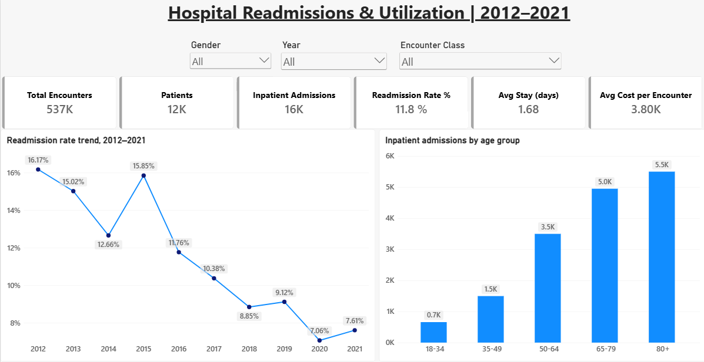
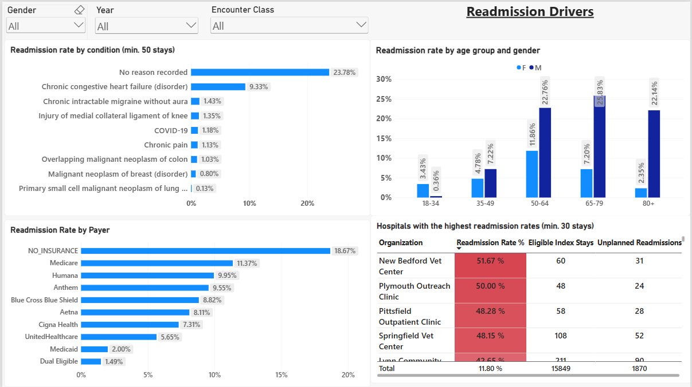
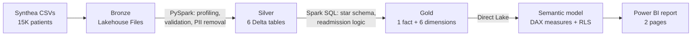

# Hospital Readmissions & Utilization Analytics

**End-to-end analytics project in Microsoft Fabric — Python (PySpark), Spark SQL, Power BI (Direct Lake), DAX, RLS**

Which patients, conditions, payers, and hospitals drive unplanned 30-day readmissions — and where should care teams focus?




---

## Headline result

| Metric | Value |
|---|---|
| Encounters analysed (2012–2021) | 536,638 |
| Patients | ~12K |
| Inpatient stays | 16,108 |
| **Unplanned 30-day readmission rate** | **11.8%** |
| Trend | **16.2% (2012) → 7.6% (2021)**, with a temporary spike in 2015 |

---

## Architecture



| Layer | Tool | What happens |
|---|---|---|
| Bronze | Lakehouse Files | Raw CSVs landed unchanged (encounters.csv alone is 408 MB) |
| Silver | PySpark notebook | Data quality checks, snake_case renaming, direct identifiers dropped (SSN, names, passport, address), length-of-stay columns added |
| Gold | Spark SQL notebook | Star schema, 30-day readmission flags, analysis window and eligibility rules |
| Semantic model | Power BI (Direct Lake) | Relationships, role-playing date dimension, DAX measures, row-level security |
| Report | Power BI | Overview + Readmission Drivers pages |

---

## Dataset

Synthetic electronic health records generated with [Synthea](https://github.com/synthetichealth/synthea), from *Chen, AJ (2022), "Medical records of 30K Synthea synthetic patients", Harvard Dataverse, https://doi.org/10.7910/DVN/BWDKXS* (population 1, 15K patients).

| Table | Rows |
|---|---|
| encounters | 1,371,435 |
| conditions | 866,514 |
| providers | 37,881 |
| patients | 15,354 |
| organizations | 6,765 |
| payers | 10 |

The data is synthetic — no real patients — so it can be published openly. The raw files are not stored in this repo (GitHub's 100 MB file limit); download them from the link above.

---

## Data quality checks (silver layer)

Run before any transformation:

| Check | Result |
|---|---|
| Duplicate primary keys (5 tables) | 0 |
| Null keys in encounters | 0 |
| Orphan foreign keys (encounters → patients/organizations/providers/payers, conditions → encounters) | 0 |
| Discharge before admission | 0 |
| Negative claim costs | 0 |
| Row counts bronze vs silver | Match exactly |

All checks passed (expected for synthetic data); the checks are built so the pipeline would catch problems with real data. Full output: [`docs/validation_results.txt`](docs/validation_results.txt).

---

## Data model

Star schema with one fact table and six conformed dimensions.

- **fact_encounter** — grain: one row per encounter, 2012–2021
- **Dimensions:** dim_date, dim_patient, dim_organization, dim_provider, dim_payer, dim_condition

Design decisions:
- **Role-playing date dimension:** `admit_date` is the active relationship to `dim_date`; `discharge_date` is inactive and activated with `USERELATIONSHIP` in readmission measures, because readmissions are measured from the discharge.
- **dim_date is generated** (one row per day) so time intelligence works reliably.
- **dim_condition has an 'UNSPECIFIED' member**, so no fact row has a blank key.
- **dim_provider is not related to dim_organization**, to keep a pure star and avoid ambiguous filter paths.

---

## Readmission definition — the investigation

The first calculated rate was **30.6%** — roughly double typical real-world rates — so I investigated before trusting it ([`notebooks/02_silver_to_gold.ipynb`](notebooks/02_silver_to_gold.ipynb), Investigations 1–4):

1. **Timing:** 2,030 "readmissions" happened 0–1 days after discharge — transfers or continued stays, not new admissions.
2. **Planned care:** readmissions at days 18–30 clustered at **21 and 28 days**. The reasons were lung and breast cancer — matching chemotherapy cycles, i.e. planned care.
3. **'No reason recorded':** these readmissions followed stays that also had no recorded reason, so there was no evidence they were planned. They were **kept** as unplanned rather than excluded without evidence.

| Step | Count |
|---|---|
| Eligible index stays | 15,941 |
| All-cause 30-day readmissions | 4,879 (30.6%) |
| − Transfers / continued stays (day 0–1) | −2,030 |
| − Planned cancer care | −967 |
| **= Unplanned readmissions** | **1,882 (11.8%)** |

**Eligibility rules:** inpatient stay, full 30 days of follow-up available in the data (handles right-censoring at the end of the dataset), patient alive at discharge. `LEAD()` over each patient's full admission history finds the next inpatient admission.

---

## Key findings

1. **Unplanned readmissions roughly halved over the decade** — from 16.2% (2012) to 7.6% (2021), with a temporary spike to 15.9% in 2015.
2. **Undocumented admissions are the biggest driver.** Index stays with no recorded reason have the highest readmission rate (23.8%). Among named conditions, **chronic congestive heart failure** is highest (9.3%), consistent with real-world readmission patterns.
3. **Uninsured patients are readmitted most** (18.7%), versus 2.0% for Medicaid and 1.5% for dual-eligible patients.
4. **Several facilities exceed 40%** — more than three times the 11.8% average — even with a minimum of 30 stays each.
5. **The gender gap is a documentation pattern, not a clinical one.** Men show higher rates in every age group, but the gap is concentrated in admissions with no recorded reason (34.3% for men vs 23.8% overall), while heart failure rates are similar across genders. This is likely a simulation artifact in the synthetic data.

### Recommendation
**Make the admission reason mandatory.** The stays with no recorded reason carry the highest readmission rate and drive the gender gap; fixing this documentation gap would sharpen every other analysis. Second priority: post-discharge follow-up for heart failure and uninsured patients, and a review of the facilities above 40%.

---

## DAX measures (selection)

Measures are organised in display folders (Volume, Readmissions, Cost & LOS, Emergency). Full list: [`docs/dax_measures.txt`](docs/dax_measures.txt).

```dax
Unplanned Readmissions =
CALCULATE(
    SUM(fact_encounter[readmit_30d]),
    USERELATIONSHIP(fact_encounter[discharge_date], dim_date[date])
)

Readmission Rate % = DIVIDE([Unplanned Readmissions], [Eligible Index Stays])

Readmission Rate % LY =
CALCULATE([Readmission Rate %], SAMEPERIODLASTYEAR(dim_date[date]))
```

The report's Readmission Rate % (11.8%) matches the SQL result exactly — the semantic model was validated against the gold layer.

---

## Report design notes
- Minimum-volume thresholds (≥50 stays for conditions, ≥30 for hospitals) keep rankings from being driven by tiny samples.
- Top N filters keep ties — zero-rate conditions are excluded explicitly so the chart shows only meaningful bars.
- Slicers (gender, year, encounter class) are synced across both pages.

## Row-level security
Role **Boston Hospitals** filters `dim_organization[city] = "Boston"` ([screenshot](screenshots/rls_role.png)); because dim_organization filters the fact table through its relationship, every measure respects the role. Fabric's *Test as role* is not supported for Direct Lake models using SSO, so the role's effect was validated with an equivalent filter.

---

## Limitations
- **Synthetic data:** patterns demonstrate the method, not real hospital performance. Average length of stay (1.7 days) is shorter than in real hospitals.
- **Missing reason codes:** many inpatient stays have no recorded reason, which limits condition-level analysis.
- **Planned-readmission rule** is based on cancer treatment only; a full planned-readmission algorithm (such as the CMS methodology) would include more procedure categories.

---

## Repository structure

```
├── notebooks/
│   ├── 01_bronze_to_silver.ipynb   # profiling, validation, silver tables
│   └── 02_silver_to_gold.ipynb     # star schema, readmission logic, investigations
├── sql/
│   └── gold_layer.sql              # gold-layer SQL
├── docs/
│   ├── validation_results.txt      # data quality + readmission reconciliation output
│   └── dax_measures.txt            # all DAX measures
└── screenshots/                    # report pages and RLS role
```

## How to reproduce
1. Download `synthea-patient-pop1-csv.zip` from the Harvard Dataverse link above.
2. In a Fabric workspace, create a Lakehouse and upload patients, encounters, conditions, organizations, providers and payers CSVs to `Files/Bronze/`.
3. Run `01_bronze_to_silver`, then `02_silver_to_gold`.
4. Create a Direct Lake semantic model on the gold tables, add the relationships and measures, and build the report.

---

*Built by Sowmya Kota*
